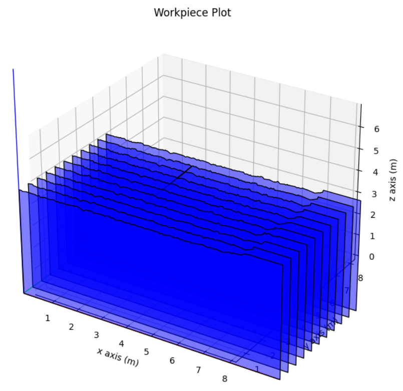
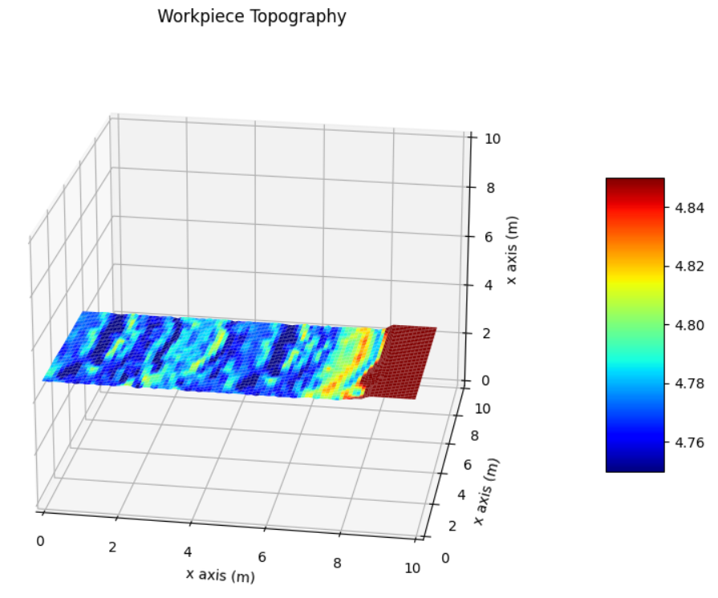
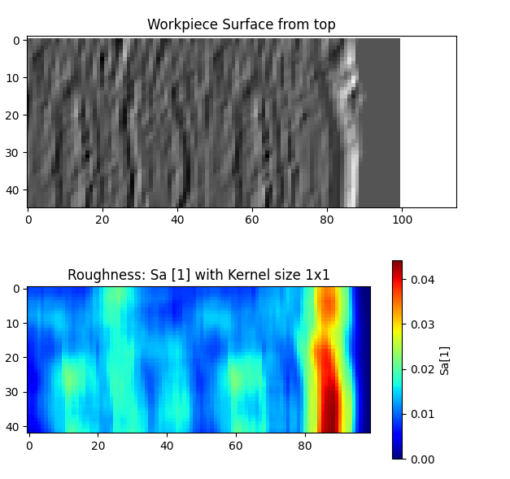

# 1\. Analyze simulation results

Simulation result analysis could vary considerably across various use-cases. The developed structure is limited for the moment. The idea is to take advantage of `Numpy` , `Scipy`, and `Matplotlib` libraries to provide thorough and meaningful depiction of results.

In this tutorial how simulation results can be analyzed is shown: First, the tool- and grain-forces are plotted over time, then the analyses are provided.

The code of this tutorial can be found at: [analyzing_results.py](/analizing_results.py)


- [1\. Analyze simulation results](#1-Analyze-simulation-result)
  - [1.1. Load stored simulation data](#11-Load-stored-simulation-data)
  - [1.2. Analyze force results](#12-Analyze-force-results)
    - [1.2.1. Calculate desired values](#121-Calculate-desired-values)
    - [1.2.2. Plot forces](#122-Plot-forces)
  - [1.3. Analyze wear results](#13-Analyze-wear-results)  
  - [1.4. Analyze workpiece surface](#14-Analyze-workpiece-surface)
    - [1.4.1.Surface inspection](#141-workpiece-inspection)
    - [1.4.2. Surface topography](#142-Surface-topography)
  - [1.5. Calculate roughness measures](#15-Calculate-roughness-measures)

## 1.1. Load stored simulation data

```python
# load data from past simulation
path = ".\\Resources\\SimulationResults\\MyFancySimulation_200_grains"
wp = Workpiece.load_from_disk(os.path.join(path, 'wp_after_grinding.pkl'))
tool = Tool.load_from_disk(os.path.join(path, 'tool_after_grinding.pkl'))
kin = Kinematics.load_from_disk(os.path.join(path, 'kin.pkl'))
grain_forces = GrainForceModelResultListNumpyArrays.load_from_disk(
    os.path.join(path, 'grain_forces.pkl')) # Forces in individual grain frames
tool_forces = ToolForceModelResultListFloat.load_from_disk(
    os.path.join(path, 'tool_forces.pkl')) # Forces in tool frame at each process step
global_forces = ToolForceModelResultListFloat.load_from_disk(
    os.path.join(path, 'global_forces.pkl')) # Forces in global frame of the process
wear_model_results = AttritiousWearModelResultList.load_from_disk(
        os.path.join(path, 'wear_model_results.pkl'))  # Wear magnitudes per grain per process step
```

## 1.2. Analyze force results

### 1.2.1. Calculate desired values

```python
# Calculate magnitude of grain Forces
grain_forces_magnitude = []
for grain_idx in range(len(grain_forces.grain_forces_x)):
    grain_forces_magnitude.append(
        np.sqrt(np.square(grain_forces.grain_forces_x[grain_idx])
                + np.square(grain_forces.grain_forces_y[grain_idx])
                + np.square(grain_forces.grain_forces_z[grain_idx])))
```

> **Note:**  Since at this point we are only interested in magnitude of grain forces we do not need to change frame there.

### 1.2.2. Plot forces

Show change in magnitude of total force on the tool, and forces on individual grains:

```python
# plot forces
# plot magnitude of global force
global_forces_abs = np.sqrt(np.square(global_forces.tool_forces_x)
                          + np.square(global_forces.tool_forces_y)
                          + np.square(global_forces.tool_forces_z))

fig, axs = plt.subplots(2, sharex=True)
axs[0].plot(kin.ToolTrajectory.times, global_forces_abs)
axs[0].set_xlabel('time [s]')
axs[0].set_ylabel('Global Force [N]')
axs[0].set_title('Global force magnitude [N]')
axs[0].grid()

# plot magnitude of grain forces
for grain_force in grain_forces_magnitude:
    axs[1].plot(kin.ToolTrajectory.times, grain_force)
axs[1].set_xlabel('time [s]')
axs[1].set_ylabel('Grain Forces [N]')
axs[1].set_title('Grain forces magnitude [N]')
axs[1].grid()
fig.tight_layout()
plt.show()
```


Show the components of force on the tool along each axis of global frame:

```python
# plot components of tool forces in global frame

fig, ax = plt.subplots(3, sharex=True)
ax[0].plot(kin.ToolTrajectory.times,
            global_forces.tool_forces_x, label='F_x')
ax[0].set_xlabel('time [s]')
ax[0].set_ylabel('Force - x [N]')
ax[0].set_title('Global Force single components [N]')
ax[0].grid()

ax[1].plot(kin.ToolTrajectory.times,
            global_forces.tool_forces_y, label='F_y')
ax[1].set_xlabel('time [s]')
ax[1].set_ylabel('Force - y [N]')
ax[1].set_title('Global Force single components [N]')
ax[1].grid()

ax[2].plot(kin.ToolTrajectory.times,
            global_forces.tool_forces_z, label='F_z')
ax[2].set_xlabel('time [s]')
ax[2].set_ylabel('Force - z [N]')
ax[2].set_title('Global Force single components [N]')
ax[2].grid()
fig.tight_layout()
plt.show()
```


Represent the forces in a new frame and plot the components:

```python
# plot forces in a new frame
# pose of new frame with respect to global frame

new_frame_pose = Pose.from_rotation_axis_angle(Vector.e_z(), np.pi/2)
# new_frame_pose = kin.ToolTrajectory.poses[0] # initial tool pose as new frame

# forces in new frame
new_frame_forces = global_forces.get_global_forces_in_new_frame(
    new_frame_pose)

fig, ax = plt.subplots(3, sharex=True)
ax[0].plot(kin.ToolTrajectory.times,
            new_frame_forces.tool_forces_x, label='F_x')
ax[0].set_xlabel('time [s]')
ax[0].set_ylabel('Force - x [N]')
ax[0].set_title('New Frame Force x component [N]')
ax[0].grid()

ax[1].plot(kin.ToolTrajectory.times,
            new_frame_forces.tool_forces_y, label='F_y')
ax[1].set_xlabel('time [s]')
ax[1].set_ylabel('Force - y [N]')
ax[1].set_title('New Frame Force y component [N]')
ax[1].grid()

ax[2].plot(kin.ToolTrajectory.times,
            new_frame_forces.tool_forces_z, label='F_z')
ax[2].set_xlabel('time [s]')
ax[2].set_ylabel('Force - z [N]')
ax[2].set_title('New Frame Force z component [N]')
ax[2].grid()
fig.tight_layout()
```


## 1.4. Analyze wear results

Show the cumulative wear of all grains and average wear on all grains at each time step:

```python
fig, ax = plt.subplots(2)
cumulative_wear_result = []
cumulative_wear = 0
for magnitudes in wear_model_results.wears_magnitude_list:
    if magnitudes:
        cumulative_wear += sum(magnitudes)
    cumulative_wear_result.append(cumulative_wear)
ax[0].plot(cumulative_wear_result)
ax[0].set_xlabel('Time steps')
ax[0].set_ylabel('Cumulative wear (mm)')
ax[0].set_title('Cumulative grain wear over time')

average_wear_result = []
for magnitudes in wear_model_results.wears_magnitude_list:
    if not magnitudes:
        average_wear_result.append(0)
    else:
        average_wear_result.append(np.mean(magnitudes))
ax[1].plot(average_wear_result)
ax[1].set_xlabel('Time steps')
ax[1].set_ylabel('Average wear (mm)')
ax[1].set_title('Average grain wear over time')
fig.tight_layout()
```


## 1.4. Analyze workpiece surface

### 1.4.1. Surface inspection

```python
# plot workpiece surface
plot_workpiece(wp, WorkpiecePlotConfig.default(wp))
plt.show()
```



> **Note:** The workpiece is not represented in a way enabling you to get the data in a format handy to do analyses: The slices (FlatManifolds) could be placed arbitrary in space, and the boundary of them have non-constant resolution which makes it nearly impossible to do something more meaningful than to look at the beautiful picture.

### 1.4.2. Surface topography

To analyze the post-grinding surface we provide `Workpiece.to_topography()` which returns a mesh-grid-like structure called `Topography`:

```python
# topography measure
topography = wp.to_topography(0.1, 0.5)
fig = plt.figure()
ax = fig.add_subplot(111, projection='3d')
surf = ax.plot_surface(topography.X, 
                        topography.Y, 
                        topography.Z,
                        linewidth=0,  
                        edgecolor='none',
                        antialiased=True, 
                        rstride=1,cstride=1,
                        cmap=plt.cm.jet,
                        vmin=4.75, vmax=4.85)
fig.colorbar(surf, shrink=0.5, aspect=5)
ax.set_title('Workpiece Topography')
ax.set_xlabel('x axis (m)')
ax.set_ylabel('x axis (m)')
ax.set_zlabel('x axis (m)')
ax.set_xlim3d(0, 10)
ax.set_ylim3d(0, 10)
ax.set_zlim3d(0, 10)
plt.show()
```



> **Note 1:** In order to realize the workpiece topography, it has to be converted into point cloud. Since a topography needs to have at most one height value for one point on the plane points should be filtered out. For this the user must specify a `slicing_height`: all points below the `slicing_height` are ignored in the formation of the `Topography`.

> **Note 2:** The poins that represent a workpiece may be unevenly distributed (with non-uniform distance from each other). So, some sort of resampling techniques (for instance, interpolation) may be necessary: For this, the notion of `resampling resolution` may help.

## 1.5. Calculate roughness measures

Since there might be large number of roughness measurement indicators, one has been calculated so far, namely `Sa` with a kernel-size of 1x1 for illustrative purposes:

```python
# Calculate and plot Sa
topography = wp.to_topography(0.1, 0.5)
kernel = np.ones((10, 10))*1/(10*10)
mean = signal.convolve2d(topography.Z, 
                          kernel,
                          boundary='symm', 
                          mode='same')
diffs = np.abs(topography.Z-mean)
Sa = signal.convolve2d(diffs, 
                        kernel, 
                        boundary='symm', 
                        mode='same')

# Plot shaded Topography and Sa in comparison
fig, axs = plt.subplots(ncols=1, nrows=2)
ls = LightSource(azdeg=315, altdeg=45)
axs[0].imshow(ls.hillshade(topography.Z, vert_exag=1), cmap='gray')
axs[0].set_title('Workpiece Surface from top')
img = axs[1].imshow(Sa, cmap=plt.cm.jet)
axs[1].set_title('Roughness: Sa [1] with Kernel size 1x1')
bar = plt.colorbar(img)
bar.set_label('Sa[1]')
plt.show()
```


