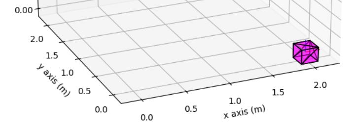
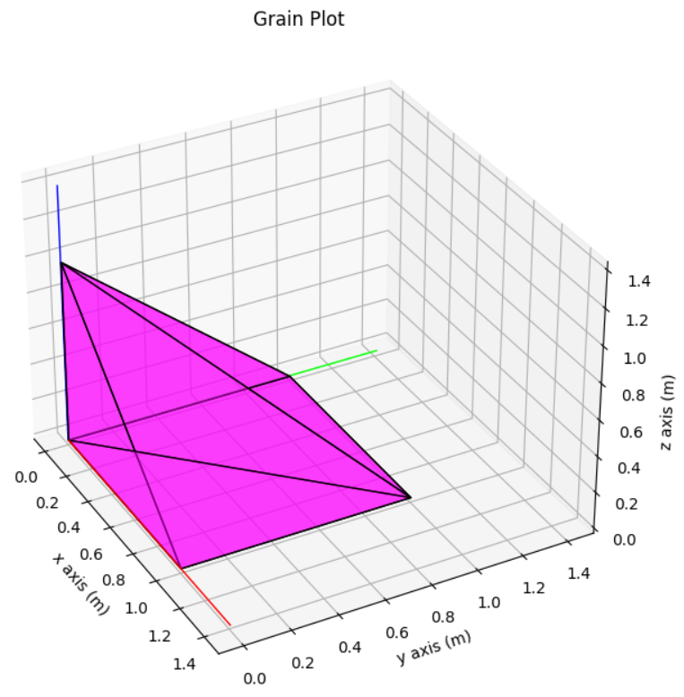

# Constructing Objects

## 1\. Introduction

Grain in iBrus is realized with two main attributes: a Mesh, and a pose in tool frame. A Mesh, itself, consists of a list of triangles, and a pose in grain frame. For efficiently calculating if a grain possibly interacts with the workpiece, a bounding sphere as a primitive representation of the grain is automatically calculated while instantiating. There are three additional attributes that used depending on process type selected by user. A vector representing the distance of grain center from tool surface can be added as 'center_protrusion' of grain, enabling more options for grain distribution on a tool. For faster simulation runs, a pre-projected version of grain can be created as 'reduced_grain'. If pullout is enabled, grain will have an attribute representing this state.

```python
class Grain:
   __mesh: Mesh
    pose: Pose
    center_protrusion: Vector
    bounding_sphere_radius: float
    bounding_sphere: Sphere
    __reduced_grain: ReducedGrain
    pullout: bool
```

The code of this tutorial can be found here: [construction_objects.py](./../../Tutorials/ConstructingObjects/construction_objects.py)


- [Constructing Objects](#constructing-objects)
  - [1\. Introduction](#1-introduction)
  - [2\. Grain from .stl](#2-grain-from-stl)
  - [3\. Grain from factory-method](#3-grain-from-factory-method)
  - [4\. Manually define a grain](#4-manually-define-a-grain)
## 2\. Grain from .stl

The most popular mesh generation is calling a mesh-containing stl file. Therefore, iBrus provides the functionality to generate a grain object from an STL file. One may just pass the stl file path to `Grain.from_stl()` method; This will convert the mesh in STL file into a Mesh defined by iBrus and generate a Grain object.

```python
# from stl file
path = "./SimulationToolbox/PhysicalObjects/stl_file/Cuboctahedron.stl"
grain_1 = Grain.from_stl(path = path,
                         grain_pose = Pose.identity(),
                         mesh_pose = Pose.identity())
plot_grain(grain_1, GrainPlotConfig.default())
```


## 3\. Grain from factory-method

Interchangeably, factory methods can be used to generate box-shape grains, without the need to read some .stl. Using the factory method for grains construction can be expanded to various forms and shapes depending on various use-case scenario:

```python
# from factory method
grain_2 = Grain.get_box_grain(
    size=0.2, pose=Pose.from_translation(Vector(2, 0, 0)))
plot_grain(grain_2, GrainPlotConfig.default())
```



## 4\. Manually define a grain

Before constructing a grain, we need to construct a mesh:

```python
# construct a mesh for the grain
vertices = [Vector.origin(), Vector(1, 0, 0), Vector(0, 0, 1),
            Vector(1, 1, 0), Vector(0, 1, 0)]

triangle_indices = [[0, 1, 2], [2, 1, 3], [
    2, 3, 4], [0, 2, 4], [0, 1, 3], [0, 3, 4]]

mesh = Mesh(vertices, triangle_indices, Pose.identity())
```

> **Note:** While defining triangle indices, users have to keep in mind that the 3 points of triangle must not form a straight line  (otherwise the points are not representing a triangle!). This means the connection of these 3 points should actually form a triangular area.

```python
# construct a grain with a mesh
grain_3 = Grain(Pose.identity(), mesh)
plot_grain(grain_3, GrainPlotConfig.default())
```



> **Note:** Each object of Grain and Mesh classes potentially have distinct Poses. They can refer to different Frames (or loosely speaking different coordinate systems). Grain is living in a tool's Frame, while Mesh is living in grain's Frame. Although the value of `grain.pose` and `mesh.pose` might be the same, they are not equivalent in nature.
