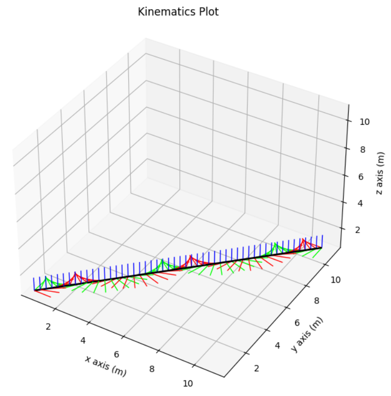
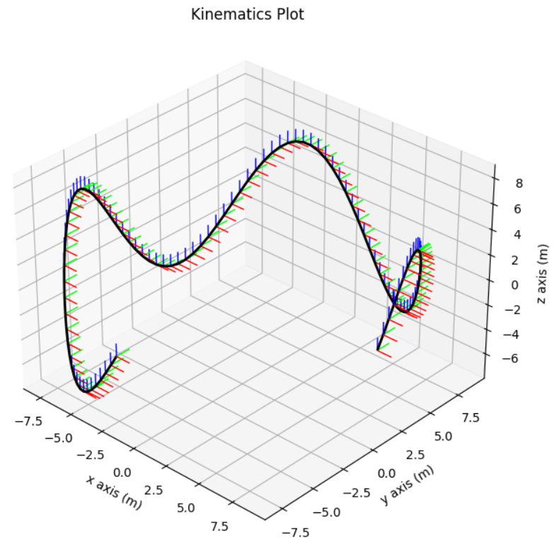

# How to construct Kinematics

`Kinematics` defines the movement of the tool over time and hence how tool and workpiece interact with each other. At the moment the developed structure is for a rigid Kinematics meaning that Kinematics is pre-specified via Pose Trajectory and not, for example, with mechanical equations:

```python
class Kinematics:
    ToolTrajectory: PoseTrajectory

class PoseTrajectory:
    poses: List[Pose]
    times: List[float]
```

The code of this tutorial can be found here: [construction_objects.py](./../../Tutorials/ConstructingObjects/construction_objects.py)


- [How to construct Kinematics](#how-to-construct-kinematics)
  - [Define rigid Kinematics with using factory method](#define-rigid-kinematics-with-using-factory-method)
  - [Manually define a rigid Kinematics](#manually-define-a-rigid-kinematics)

## Define rigid Kinematics with using factory method

```python
kin_3 = Kinematics.from_feedrate_\
  and_rotation_speed(start_point=Vector(0, 1, 0),
                     axis=Vector.e_z(),
                     rotation_speed=10/360 * np.pi,
                     feed=Vector(0, 1, 0),
                     end_time=5,
                     time_step_size=1)
```



## Manually define a rigid Kinematics

```python
# Manually define a roller-coaster-like rigid Kinematics
times = [1, 2, 3, 4, 5]
poses = []
times = np.linspace(0, 1.5*np.pi, 100)
for t in times:
    position = Vector(np.cos(t), np.sin(t), 0.5*np.sin(4*t)).scale(10)
    poses.append(Pose.from_translation(position))

trajectory = PoseTrajectory(times, poses)
kin_2 = Kinematics(trajectory)

# plot kinematics
plot_kinematics(kin_2, KinematicsPlotConfig.default(), pose_scale=1)
```


