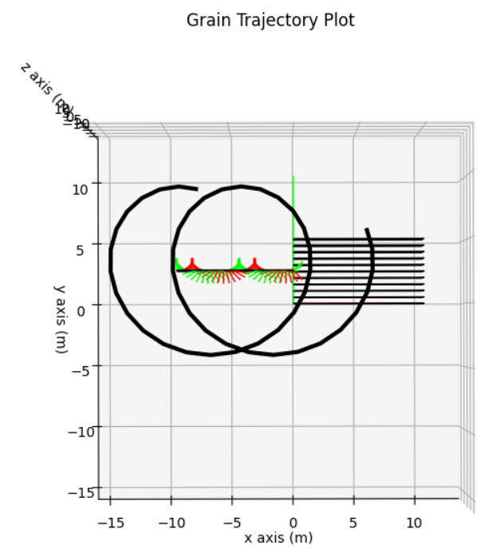

# 1\. Introduction

In this tutorial, a simulation for a simple rail-grinding process is set up, simulated, and the results are analyzed after. Users may refer to a more detailed step-wise description at: [process_simulation_walkthrough.py](/process_simulation_walkthrough.py)

## 1.1\. Table of contents

- [1\. Introduction](#1-introduction)
  - [1.1\. Table of contents](#11-table-of-contents)
- [2\. Constructing Simulation Objects](#2-constructing-simulation-objects)
  - [2.1\. Constructing tool](#21-constructing-tool)
  - [2.2\. Constructing workpiece](#22-constructing-workpiece)
  - [2.3\. Define kinematics](#23-define-kinematics)
- [3\. Feasibility checks](#3-feasibility-checks)
  - [Process feasibility](#process-feasibility)
  - [Simulation feasibility check and performance increase: check approach angles & use_reduced_grain](#simulation-feasibility-check-and-performance-increase-check-approach-angles--use_reduced_grain)
- [4\. Simulation](#4-simulation)
  - [Save results to disk](#save-results-to-disk)
- [5\. Simulation with animation](#5-simulation-with-animation)

# 2\. Constructing Simulation Objects

## 2.1\. Constructing tool

A tool is partly a combination of grains. To define a tool, grains shall be defined first. For the rail-grinding wheel cuboctahedron-shaped grains are selected, which are loaded from an STL file.

```python
# Define a grain
path = "./SimulationToolbox/PhysicalObjects/stl_file/Cuboctahedron.stl"
grain = Grain.from_stl(path, Pose.identity(), Pose.identity())
# Generate a tool out of the grain
tool = Tool.from_diameter(basic_grain=grain,
                          inner_diameter=6,
                          outer_diameter=9,
                          number_of_grains=50,
                          tool_pose=Pose.identity())

# plot the grain
grain_plot_config = GrainPlotConfig.from_color(Color.magenta())
plot_grain(grain, grain_plot_config)
```

<b>Cuboctahedron-shaped grain</b>


> To learn more about grain construction have a look at: [Grain Tutorial](/Tutorials/ConstructingObjects/grains.md)

```python
# plot the tool
tool_plot_config = ToolPlotConfig.from_tool_and_color(
    tool, Color.magenta())
plot_tool(tool, tool_plot_config)
```

<b>Tool with cuboctahedron-shaped grains</b>


> To learn more about tool construction have a look at: [Tool Tutorial](/Tutorials/ConstructingObjects/tools.md)

## 2.2\. Constructing workpiece

For the grinding process a box-shaped workpiece is defined. For this a box is first constructed and then the factory method `Workpiece.from_box()` is used.

```python
# Define a box shaped workpiece with 5 planes
box = Box.from_sizes(size_x=10, 
                     size_y=5,
                     size_z=5,
                     pose=Pose.identity())
wp = Workpiece.from_box(box, spatial_resolution=0.5)

# plot workpiece
wp_plot_config=WorkpiecePlotConfig.default(wp)
plot_workpiece(wp,wp_plot_config)
```

<b>Box-shaped workpiece</b>


> To learn more about workpiece construction, have a look at: [Workpiece Tutorial](/Tutorials/ConstructingObjects/workpieces.md)

## 2.3\. Define kinematics

The kinematics of a rail grinding process is defined with ToolPoses representing the trajectory.

```python
# 1.3 Define kinematics
feed_rate = 8
start_point = Vector(0, 0, 50)
rotation_axis = Vector.e_z()
rotational_speed = 30/360 * np.pi
feed = Vector(0, feed_rate, 0)
end_time = 14
time_step_size = 1

kin = Kinematics.from_feedrate_and_rotation_speed(
    start_point, rotation_axis,
    rotational_speed,
    feed,
    end_time, time_step_size)

# plot kinematics
plot_kinematics(kin)
```

<b>Revolving wheel's Pose</b>


> To learn more about kinematics definition have a look at: [Kinematics Tutorial](/Tutorials/ConstructingObjects/kinematics.md)

# 3\. Feasibility checks

## Process feasibility

In order to check if grains will interact with the workpiece in the desired way, the Workpiece, Wheel and trajectory are plotted all together.

```python
process = Process(tool, wp, kin)
plot_process(process, ProcessPlotConfig.default(process))
```

<b>Grinding setup: isometric view</b>


<b>Grinding setup: front view</b>


<b>Grinding setup: top view</b>


Now we need to check if the defined trajectory results in feasible grain movements:

```python
# visualize grain trajectory
plot_grain_trajectory(process=process,
                      grain_index=0,
                      plot_config=ProcessPlotConfig.default(process))
```

<b>Movement of grain "0"</b>



> To learn more about visualization have a look at: [Visualization Tutorial](/Tutorials/Visualization/visualization.md)

## Simulation feasibility check and performance increase: check approach angles & use_reduced_grain

Since the workpiece is modelled by a collection of slices, there are certain limitations in material removal calculation. These limitations are overcome by assuring/assuming that approach-angles of grains, passing planes are not too flat, i.e. larger than 45 degrees.

When the material remover configuration is created, there are two arguments to be set, which are: `use_reduced_grain` and `check_approach_angle`. `use_reduced_grain` is an optional argument that provides slightly faster simulation by using a simpler version of grain projection. The option to have wear is also set with this config.

```python
# Setting up Simulation
mat_remover_config = MaterialRemovalConfig(
    use_reduced_grain, check_approach_angle, apply_wear, CollisionDetectionConfig.for_partial_tool_wp_contact_process(tool, wp, kin))
```

`check_approach_angle` is an option to safe check if simulation is within the desired boundary condition. When it's set to `True`, the MaterialRemover will go through the **entire simulation** once before actual material removal happens, to check if approach angle between grain and workpiece slice is smaller than 45 degrees. If there happens to be approach angles smaller than 45 degrees while simulating, a warning message will be printed to the console.

```python
"Warning: approach angle smaller than 45 degrees."
```

The drawback of approach angle checking, is an overhead of computation time. When the user want to do a pre-simulation approach angle check, it needs to be set to `True` explicitly, when initiating `MaterialRemover`. A pre-simulation check will potentially save users a lot of time, since the check could be performed with fewer grains and planes before starting a simulation lasting days in full resolution.

# 4\. Simulation

Before the simulation can be started, the MaterialRemover (The algorithm which performs the material removal based on the movement of the tool) needs to be instantiated. Empty lists, for capturing results, need to be created also.

```python
start_tool_pose = kin.ToolTrajectory.poses[0]

matRemover = MaterialRemover(wp,
                                tool,
                                start_tool_pose,
                                kin, mat_remover_config)
force_model_config = GrainForceModelConfiguration(1, 0.3)
grain_force_results = []
tool_force_results = []
wear_model_results = AttritiousWearModelResultList([], [])

# Initiate lists for animation input collection
# workpieces: List[Workpiece] = []
# tools: List[Tool] = []

# # Simulation loop
for current_tool_pose in kin.ToolTrajectory.poses:
    # remove material
    mat_remover_result = \
        matRemover.update(wp,
                            tool,
                            current_tool_pose,
                            mat_remover_config)

    # apply wear
    wear_model_result = apply_attritious_wear_model(
        tool, wear_magnitude_as_penetration_depth_percentage, mat_remover_result)
    apply_attritious_wear(wear_model_result, tool,
                            mat_remover_result, use_reduced_grain)

    # Collecting wp/tool instances for animation
    # workpieces.append(copy.deepcopy(wp))
    # tools.append(copy.deepcopy(tool))

    # apply physical models
    grain_force_model_result = grain_force_model(mat_remover_result,
                                                    tool,
                                                    force_model_config)
    tool_force_model_result = tool_force_model(grain_force_model_result,
                                                tool)

    # apply bond_wear and pullout
    bond_wear_model_result = apply_archard_bonding_wear_model(tool,
                                                                1, 1, grain_force_model_result)
    apply_bonding_wear(bond_wear_model_result, tool)
    apply_pullout_condition(
        tool, grain_force_model_result, mat_remover_result, bonding_strength=0.05)

    # capture results in a list
    tool_force_results.append(tool_force_model_result)
    grain_force_results.append(grain_force_model_result)
    wear_model_results.wears_vector_list.append(
        wear_model_result.wears_vector)
    wear_model_results.wears_magnitude_list.append(
        wear_model_result.wears_magnitude)

```

## Save results to disk

> **Note:** The tool/grain- forces are represented in the tool frame. In order to analyze tool forces properly we need to represent them in a global frame with `tool_forces.get_forces_in_global(kin.ToolTrajectory)`

```python
# save simulation objects and results to disk for later analysis
# convert to handier format
grain_forces_array = GrainForceModelResultListNumpyArrays.from_grain_force_model_result_list(
    grain_force_results) # Forces in grain_frame
tool_forces_array = ToolForceModelResultListFloat.from_tool_force_model_result_list(
    tool_force_results) # Forces in tool frame
global_forces_array = tool_forces_array.get_forces_in_global(kin.ToolTrajectory) # Forces in global frame of process


# save to disk
path = r"./Tutorials/Resources/SimulationResults/MyFancySimulation"
wp.save_to_disk(os.path.join(path, 'wp_after_grinding.pkl'))
tool.save_to_disk(os.path.join(path, 'tool_after_grinding.pkl'))
kin.save_to_disk(os.path.join(path, 'kin.pkl'))
grain_forces_array.save_to_disk(os.path.join(path, 'grain_forces.pkl'))
tool_forces_array.save_to_disk(os.path.join(path, 'tool_forces.pkl'))
global_forces_array.save_to_disk(os.path.join(path, 'global_forces.pkl'))
```

> To learn how to analyze the simulation results consult: [Analyzing Results Tutorial](/Tutorials/AnalysingResults/analysing_results.md)

# 5\. Simulation with animation

Currently, a simple function for animation the results of a simulation is provided. In order to utilize this function, the instances of tool and workpiece at each step of the process simulation should be provided as inputs. The simulation loop can be modified as follows to extract these inputs:

```python
workpieces: List[Workpiece] = []
tools: List[Tool] = []

# # Simulation loop
for current_tool_pose in kin.ToolTrajectory.poses:
    # remove material
    mat_remover_result = \
        matRemover.update(wp,
                            tool,
                            current_tool_pose,
                            mat_remover_config)

    # apply wear
    wear_model_result = apply_attritious_wear_model(
        tool, wear_magnitude_as_penetration_depth_percentage, mat_remover_result)
    apply_attritious_wear(wear_model_result, tool,
                            mat_remover_result, use_reduced_grain)

    # Collecting wp/tool instances for animation
    workpieces.append(copy.deepcopy(wp))
    tools.append(copy.deepcopy(tool))

    # apply physical models
    grain_force_model_result = grain_force_model(mat_remover_result,
                                                    tool,
                                                    force_model_config)
    tool_force_model_result = tool_force_model(grain_force_model_result,
                                                tool)

    # apply bond_wear and pullout
    bond_wear_model_result = apply_archard_bonding_wear_model(tool,
                                                                1, 1, grain_force_model_result)
    apply_bonding_wear(bond_wear_model_result, tool)
    apply_pullout_condition(
        tool, grain_force_model_result, mat_remover_result, bonding_strength=0.05)

    # capture results in a list
    tool_force_results.append(tool_force_model_result)
    grain_force_results.append(grain_force_model_result)
    wear_model_results.wears_vector_list.append(
        wear_model_result.wears_vector)
    wear_model_results.wears_magnitude_list.append(
        wear_model_result.wears_magnitude)

```

In the current format, it is suggested to use animation only for the processes with less than 1000 steps. For longer processes the phase of gathering inputs increases simulation time considerably.

After gathering the inputs for animation, the `animate_process` method is called with these inputs plus the process kinematics. As an option, the save path and the name for the animation file can be speficied, otherwise it will be saved at the location of the code repository with name `Process_simulation.mp4` as default. 

```python
animation_path = r"./Resources/SimulationResults/MyFancySimulation/My_simulation.mp4"
animate_process(tools, workpieces, kin, save_path=animation_path)
```

> **Note:** The animations use ffmpeg as the writer, so it needs to be added to environment variables of your computer. To learn how to do it: [Software Installation Tutorial](/Tutorials/SwInstallation/software_installation.md)