<!--format it as markdown with headings and so like in readme-->
This is the tutorial for necessary software installation to run iBrus code in Windows operating system from scratch.

1) Install Python: https://www.python.org/downloads/
   1) Select one python version that is bigger or equal to 3.7, for example 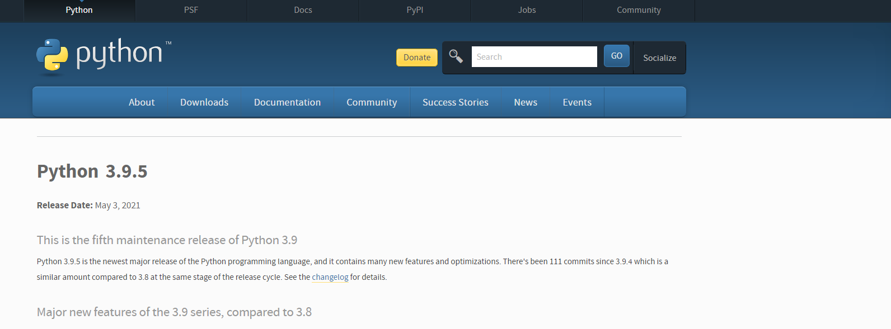
   2) Scroll down to the bottom of the page and select an installable files from files. Select "Windows Installer" if there is any that matches with your system version 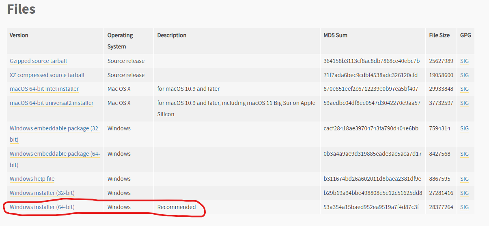
   3) Run the Windows installer. Make sure to click "Add Python to PATH" 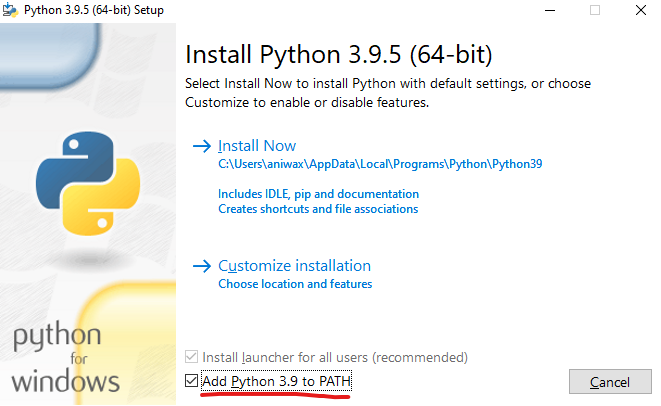
   4) Go to PowerShell or CommandPromt to check, if your python is added to the path succesfully. If yes, you will see the correct python version when you call "python" in the PowerShell or Command Prompt.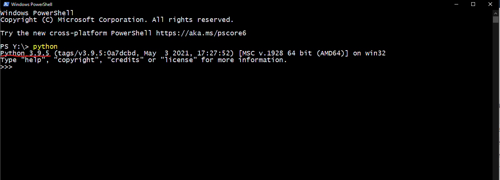
   5) You can find the python location by typing "where python" in command line. 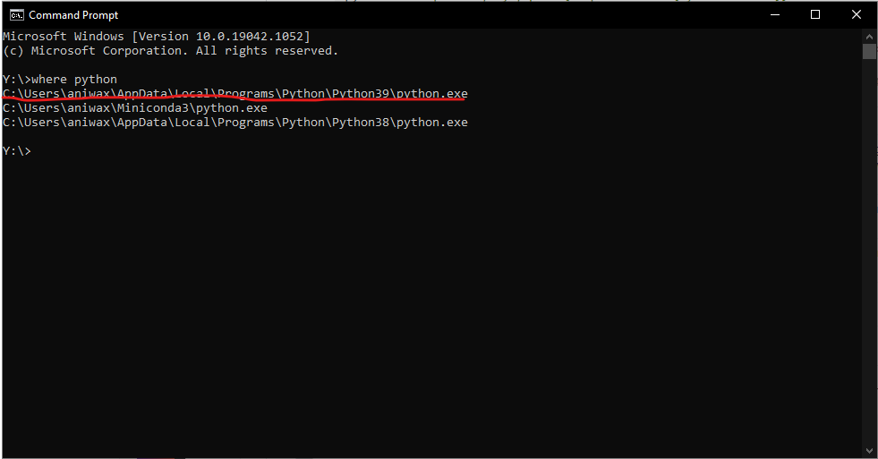

2) Check if *pip* is installed, if not install pip: https://pip.pypa.io/en/stable/installing/

3) Install *virtualenv* tool to create a virtual environment for iBrus, by typing *pip install virtualenv* to Command Prompt

4) Create an empty folder for a new virtual environment, then create the virtual environment by typing *python -m venv {Folder path}* to Command Prompt

    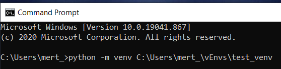

5) Use change directory command *cd' to get to *Scripts* subfolder in the virtual env. folder, then activate the virtual env. by typing *.\activate*

    

6) Copy *requirements.txt* to the virtual environment folder. Change directory to virtual env. folder, then type *pip install -r requirements.txt* to Command Prompt to install required packages

    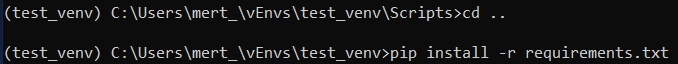

7) Install the iBrusToolbox: 
   1) The installable iBrusToolbox package can be found in the repository as its shown here 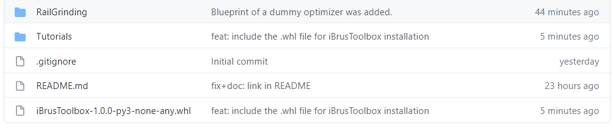
   2) It can be installed from the command line like using following command 

8) Install Visual Studio Code for Windows: https://code.visualstudio.com/docs/setup/windows

9)  Install GitHub Desktop for Windows: https://desktop.github.com/

10) Open GitHub Desktop, select *Add* in Current repository, use *Clone repository* to select iBrus repository

    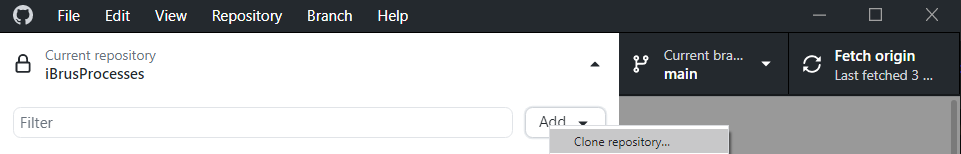

11) From a repository, select *Open in Visual Studio Code*
    - If the default code editor is different, it needs to be changed from ' File -> Options -> Integrations -> External editor'

    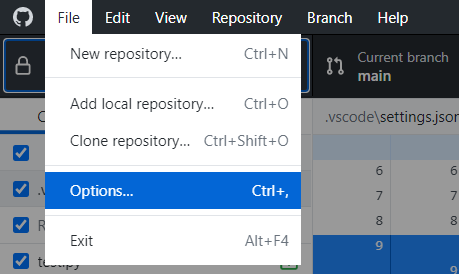 

    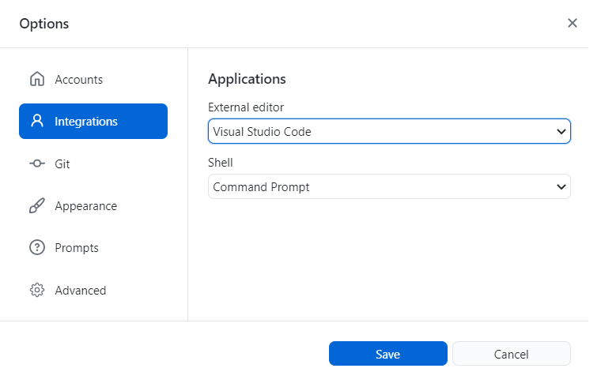

12) In Visual Studio Code, search and install following extensions from *Extensions* menu:
    - Python (required)
    - Pylance (suggested)
    - Markdown All in One (suggested)
    - Python Indent (suggested)
    - Todo Tree (suggested)

    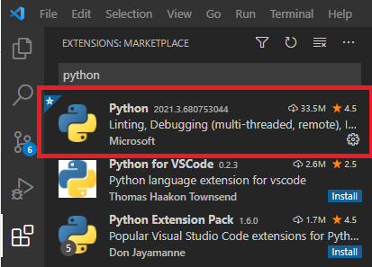

13) In Visual Studio Code, select the virtual environment as the python interpreter:
    - Press Ctrl-Shift-P and type *Python: Select Interpreter* or use *Select Python Interpreter* at down left
    - Browse for the new environment path and select python.exe in *Scripts* folder

    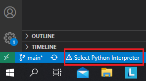

    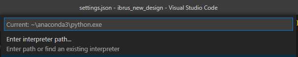

14) Run the tests from *Test* menu on th left bar of Visual Studio Code. The setup is ready when all tests pass.

    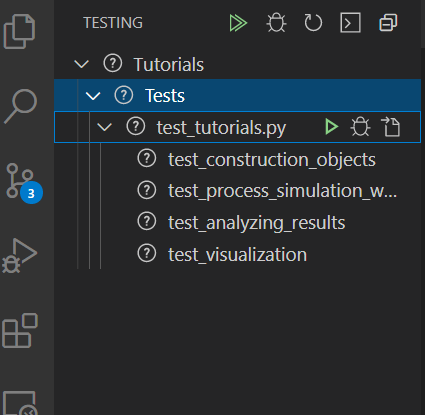

15) [Optional,for animations] Add ffmpeg.exe path to your environment variables: http://blog.gregzaal.com/how-to-install-ffmpeg-on-windows/