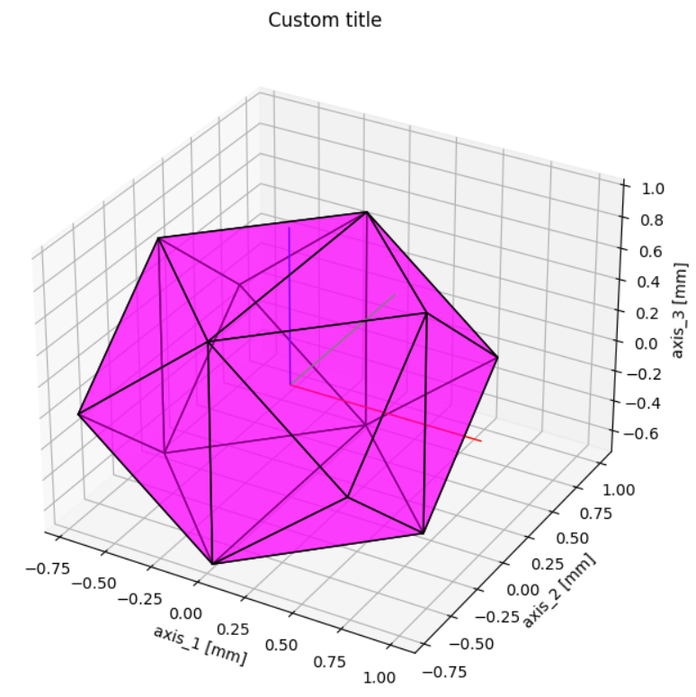
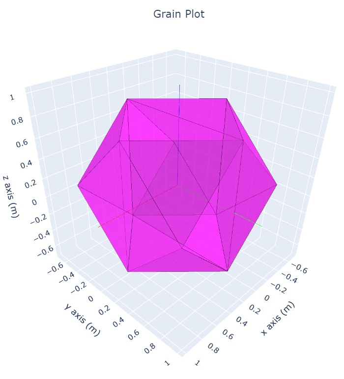
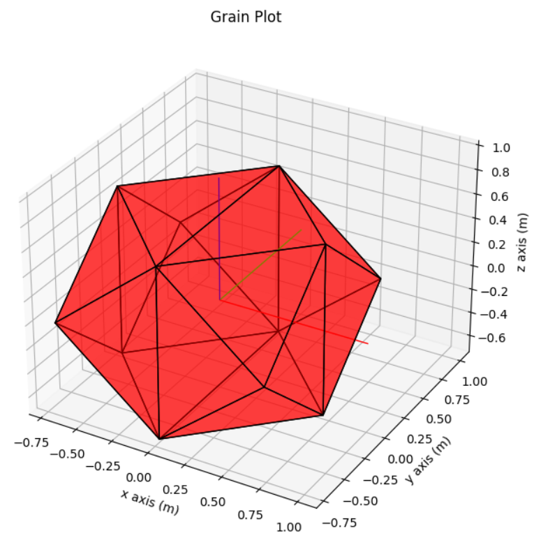
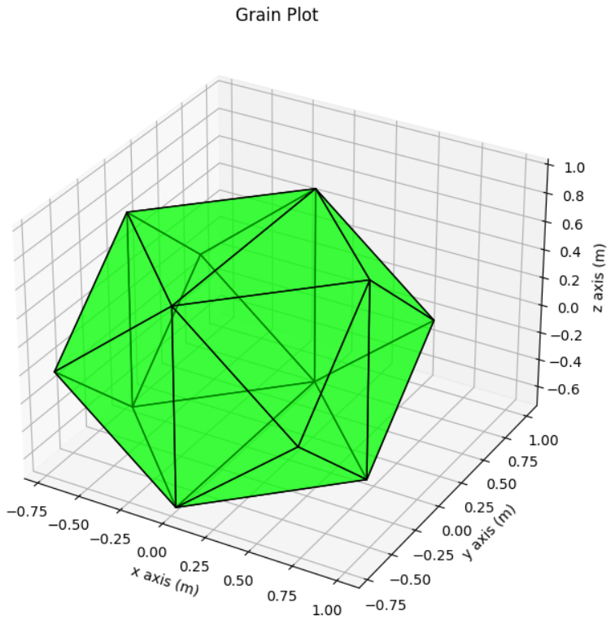
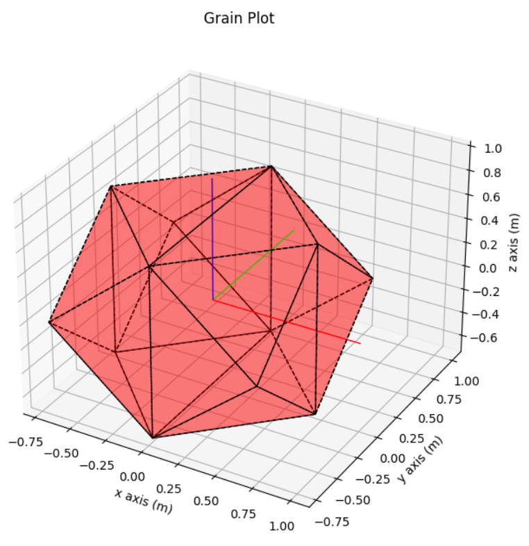
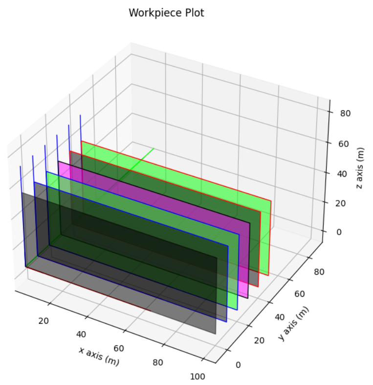

# 1\. Visualization Tutorial

In this tutorial, simulation objects visualization with the help of the `Visualization` module are elaborated. The code of this tutorial can be found here: [visualization.py](/Tutorials/Visualization/visualization.py)

- [1\. Visualization Tutorial](#1-visualization-tutorial)

  - [1.1\. Basic structure of visualization module](#11-basic-structure-of-visualization-module)
  - [1.2\. Plotting with default config](#12-plotting-with-default-config)
  - [1.3\. Change plot library](#13-change-plot-library)
  - [1.4\. Use class methods](#14-use-classmethods)
  - [1.5\. Alter plot configurations](#15-alter-plot-configurations)
  - [1.5\. Manually define a configuration](#15-manually-define-a-configuration)
  - [1.6\. Dynamic plot configurations](#16-dynamic-plot-configurations)

## 1.1\. Basic structure of visualization module

The visualization module is organized around `VisualComposition`. Any {object} gets mapped to a `VisualComposition` with the help of the according method `visualize_{object}`. A `VisualComposition` describes a collection of polygons, lines, and points each coming together with a plot configuration. Visual compositions can then be plotted by a single plot method.

```python
# basic class structure
class VisualComposition:
    polygons: List[PolygonVisualization]
    lines: List[LineVisualization]
    points: List[PointVisualization]
    def change_frame(self, down_chain, up_chain):
    def combine(self, other):    

def plot(composition: VisualComposition,
         plotlibrary: PlotLibrary):
```

Below, it is shown how `LineVisualization` looks like and what Polygon- Line- and Point- visualizations are:

```python
class LineVisualization:
    vector: List[Vector]
    plot_config: LinePlotConfig

class LinePlotConfig:
    color: Color
    width: float
    style: Linestyle
    alpha: float
```

## 1.2\. Plotting with default configuration

```python
# plot_{object} with default config
plot_grain(grain, GrainPlotConfig.default())
```


If not specified, the title and axis lables of plots have default values. The title will be the type of plot function called and axes will be x,y,z with unit (m). These plot properties can be changed when calling the `plot_{object}` functions: 

```python
# plot_{object} with custom title and labels
plot_grain(grain, GrainPlotConfig.default(), title='Custom title',
            axis_labels=['axis_1', 'axis_2', 'axis_3'], length_unit='[mm]')
```


## 1.3\. Change plot library

```python
# Use another plot library
plot_grain(grain, GrainPlotConfig.default(), PlotLibrary.plotly)
```



## 1.4\. Use class methods

Several class methods for plot configurations are available to set certain properties of plotted objects easily. They can be accessed by `{Object}Plotconfig.{classmethod}`. For example, to set the color of grain faces:

```python
# Select color of grain faces with class method
plot_config = GrainPlotConfig.from_color(Color.red())
plot_grain(grain, plot_config)
```



## 1.5\. Alter plot configurations

If it is desired to control multiple properties of the plot configuration, and it is not supported by a single class method, the attributes of a configuration can be changed after creating it. For example if one wants to hide the coordinate axes of the pose:

```python
# Change attributes of configuration
plot_config = GrainPlotConfig.from_color(Color.green())
plot_config.pose_plot_config = PosePlotConfig.hidden()
plot_grain(grain, plot_config)
```



## 1.5\. Manually define a configuration

For the complete control over properties of the objects, `__init__` of corresponding plot configuration class can be used. Customized subconfigurations can be passed as the arguments of object plot configuration.

```python
# Use __init__ to specify all properties
line_plot_config = LinePlotConfig(color=Color.black(),
                                    width=1,
                                    style=Linestyle.dashed,
                                    alpha=1)

poly_plot_config = PolyPlotConfig(face_color=Color.red(),
                                    boundary=line_plot_config,
                                    alpha=0.3)

plot_config = GrainPlotConfig(MeshPlotConfig(
    pose_plot_config=PosePlotConfig.default(),
    surface_config=poly_plot_config))

plot_grain(grain, plot_config)
```



## 1.6\. Dynamic plot configurations

If a user wish to have a criteria to change properties of individual objects, a `{Object}Plotconfig.from_callable` class method is available for that. The callable should be a function that takes one object and outputs a plot configuration for that object according to the criteria. For example, a callable that assigns random colors to the obejcts can be used as follows:

```python
# Plot workpiece based on a user defined and dynamic config
box = Box(0, 100, 0, 50, 0, 50, Pose.identity())
workpiece = Workpiece.from_box(box, 10)

def get_flatmanifold_config_random_color(flatmanifold: FlatManifold) \
        -> FlatManifoldPlotConfig:
    color_list = [Color.red(), Color.black(), Color.blue(),
                    Color.green(), Color.magenta()]
    return FlatManifoldPlotConfig.from_color(random.choice(color_list),
                                                random.choice(color_list))

plot_workpiece(workpiece, WorkpiecePlotConfig.from_workpiece_and_callable(
    workpiece, get_flatmanifold_config_random_color))
```



> **Note:** `{Object}PlotConfig.from_callable` can be especially helpful in displaying grains based on their state like wear, force, temperature and more.
